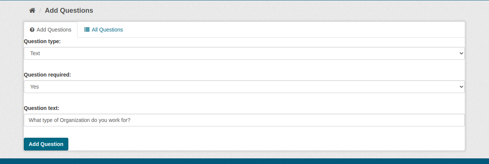
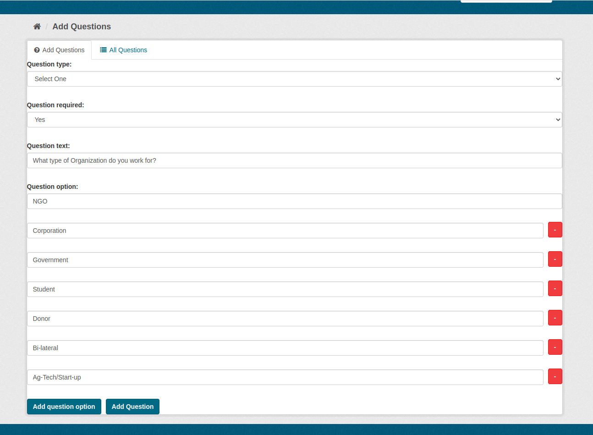
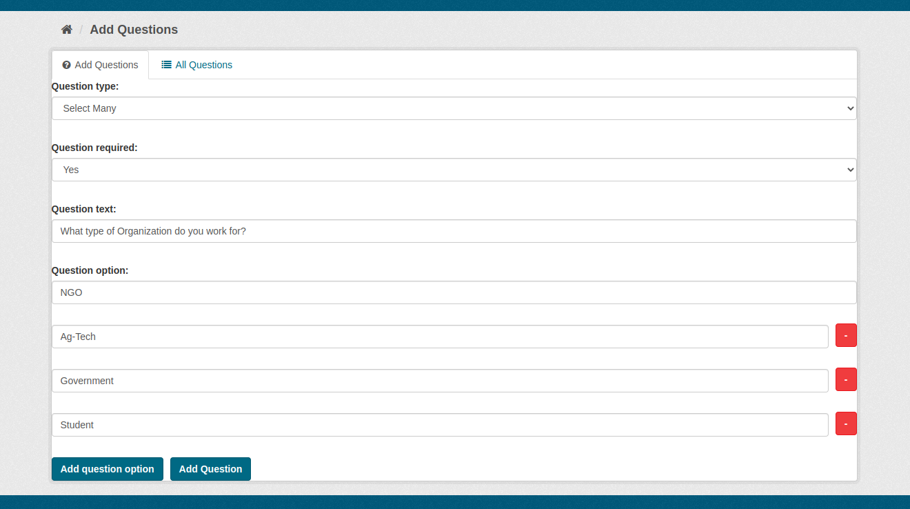
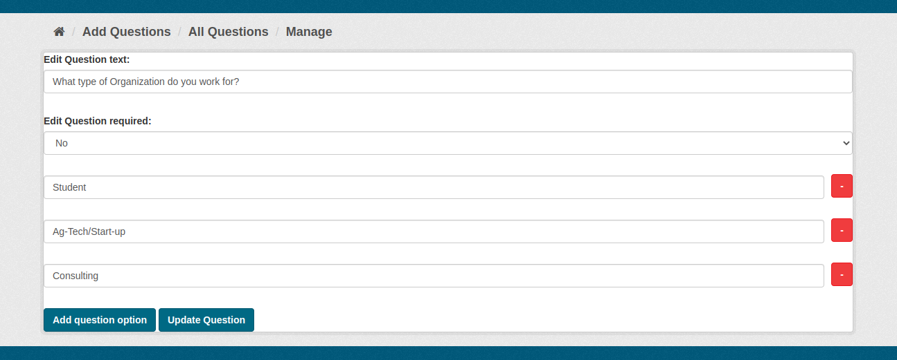
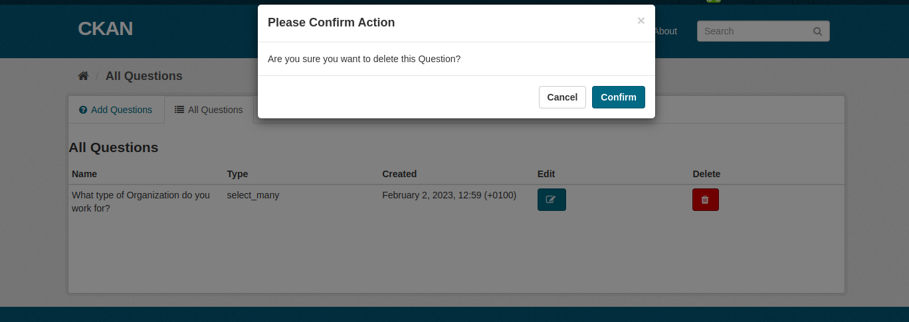
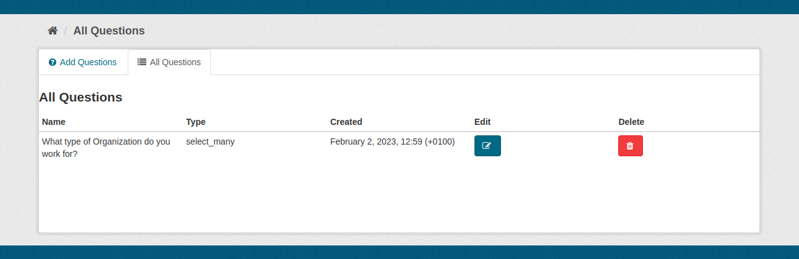

[](https://github.com/blagojabozinovski/ckanext-questionnaire/actions)

# ckanext-questionnaire

With this extension CKAN sysadmin can set up a survey for the all the users. The Questions in the survey can be added or deleted by the sysadmin and the answers can be set up to be as text, choose one or choose multiple options. The Questions are the same for all the users. 

## Requirements

Compatibility with core CKAN versions:

| CKAN version    | Compatible?   |
| --------------- | ------------- |
| 2.9             | Yes           |
| 2.10            | Yes           |
| 2.11            | Yes           |

For CKAN 2.9 use tag V1.2

## Screenshots

In order to add questions for the users, a sysadmin account is required. 


* Question interface 

By clicking on the icon on the top navigation bar, the sysadmin user is redirected to the User Questions page. Here the user can select what type of question wants to create, fulfill the question text and decide whether the question is required or not.


* Add Questions tab 

This form on the ‘Add Questions’ tab, is allowing the sysadmin user to add the questions for the users. The sysadmin can choose one of the options to define how the Question will be answered: Text, Select One option or Select Many options. Above, in Question interface part, the Text option is displayed. Below, Select One and Select Many options are displayed. Additionally, the admin can decide whether the Question is mandatory or not by filling the Required field with Yes or No. 


* Select One


* Select Many


* Editing a Question

The sysadmin user can edit the question and all of its fields and delete it.


* Deleting a Question


* Editing an Answer



## Installation

To install ckanext-questionnaire:

1. Activate your CKAN virtual environment, for example:

     . /usr/lib/ckan/default/bin/activate

2. Clone the source and install it on the virtualenv

    git clone https://github.com/keitaroinc/ckanext-questionnaire.git
    cd ckanext-questionnaire
    pip install -e .
	pip install -r requirements.txt

3. Add `questionnaire` to the `ckan.plugins` setting in your CKAN
   config file (by default the config file is located at
   `/etc/ckan/default/ckan.ini`).

4. Create the database tables running:

    ckan -c /path/to/ini/file questionnaire init-db


5. Restart CKAN. For example if you've deployed CKAN with Apache on Ubuntu:

     sudo service apache2 reload

6. For uninstalling the extension, drop the tables in the database using running:
```
ckan -c /path/to/ini/file questionnaire delete-db
```


## Config settings

When logging in the user is redirected to the Questions page available on the User Dashboard page.
You need to add the following setting in your ckan.ini file:

	route_after_login = "user.me"


## Developer installation

To install ckanext-questionnaire for development, activate your CKAN virtualenv and
do:

    git clone https://github.com/keitaroinc/ckanext-questionnaire.git
    cd ckanext-questionnaire
    python setup.py develop
    pip install -r dev-requirements.txt


## Tests

To run the tests, do:

    pytest --ckan-ini=test.ini


## License

[AGPL](https://www.gnu.org/licenses/agpl-3.0.en.html)
